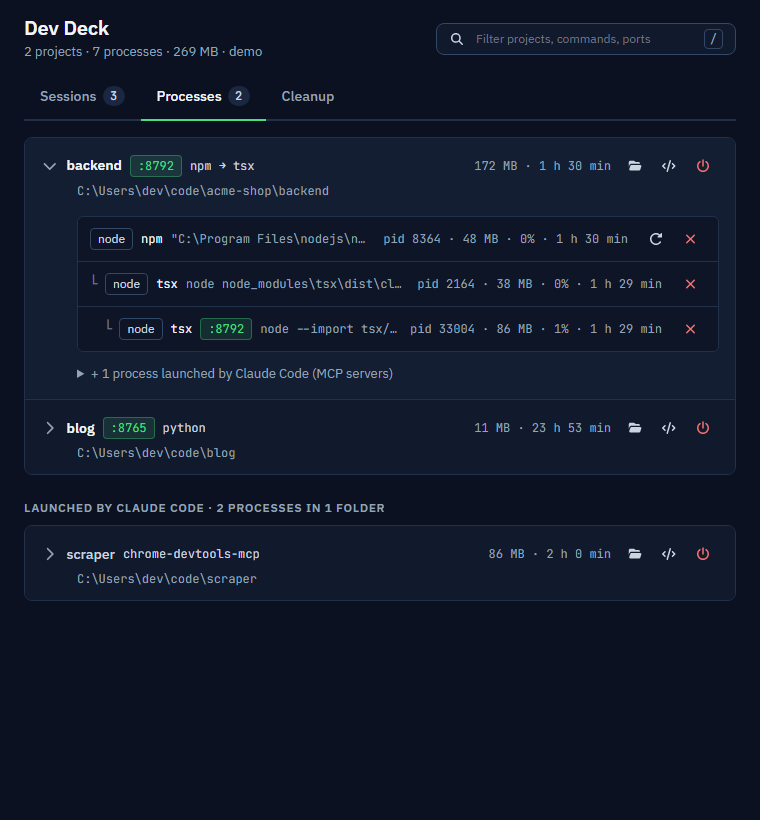
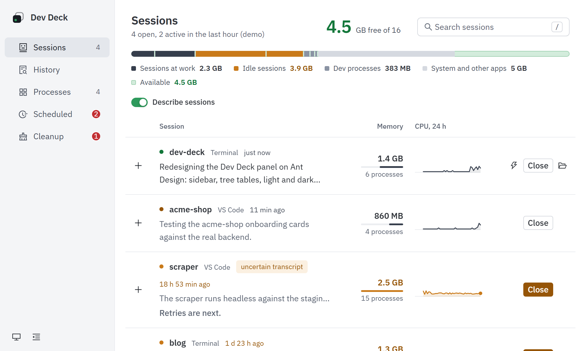

# Dev Deck

A tray panel for Windows that shows the development processes running on your machine,
grouped by project. See them, stop them, restart them, open their port or folder.

Task Manager shows twelve `node.exe`. Dev Deck shows `acme-shop/backend · npm → tsx → node · :8792`.

<picture>
  <source media="(prefers-color-scheme: dark)" srcset="docs/processes-dark.png">
  
</picture>

## Features

- **One row per project**, found by walking up from each process's working directory to the
  nearest `package.json`, `Cargo.toml`, `pyproject.toml`, `go.mod`, `pom.xml` or `.git`.
- **Every dev runtime**: node, bun, deno, python, uv, cargo, java, dotnet, go, ruby, php, with
  the tool (npm, tsx, vite, uvicorn…), memory, the CPU of the last 24 hours, uptime and
  listening ports.
- **Weight you can see**: a strip with the computer's RAM (sessions at work, idle sessions, dev
  processes, the rest, what's available), and behind every row a bar as long as the memory it
  holds. Close something and the row shows what came back, measured.
- **Process trees stay together**: `npm start` → `tsx` → `node`, even across the `cmd.exe`
  npm spawns on Windows.
- **Stop** a process tree or a whole project, **restart** a tree with the same command, folder
  and environment, **open** `localhost:PORT`, the folder, or VS Code.
- **Claude Code sessions**: what's open, in which folder, how much it holds with what runs
  under it, and (opt-in) a one-line description of what each one is working on. Close a whole
  session (the conversation stays: `claude --resume`).
- **History**: every session you opened from a terminal or VS Code, open or closed, by day,
  searchable by what it was about. **Reopen** one with a click: a terminal in its folder with
  `claude --resume <id>`, no id to remember.
- **Scheduled tasks by project**: the Windows Task Scheduler's tasks that run something in
  a project (a nightly backup, a daily scrape), with what they run, when, and how the last run
  went. Run now, disable, or delete (a copy of the definition is kept). A process a task
  started says which one.
- **Cleanup in shadow mode**: proposes what to close (orphan MCP servers, duplicates, idle
  servers, scheduled tasks whose folder is gone or that keep failing) with evidence, and never
  closes anything by itself.
- **An MCP server** so Claude Code can see and manage the same processes.
- **Light and dark**, following Windows or pinned from the sidebar, in the Windows language.

<picture>
  <source media="(prefers-color-scheme: dark)" srcset="docs/sessions-dark.png">
  
</picture>

More detail: [how it works](docs/how-it-works.md).

## Requirements

- Windows 10 or 11 (with WebView2, preinstalled on Windows 11)
- To build: [Rust](https://rustup.rs) (stable) and Node.js 24+
- Optional: the [Claude Code](https://claude.com/claude-code) CLI, for sessions and the MCP server

## Install

Download the installer from the Releases page (it isn't code-signed, so SmartScreen may warn
on first run), or build it:

```
npm install
npm run build
```

The installer lands in `src-tauri/target/release/bundle/nsis/`; the plain exe is
`src-tauri/target/release/dev-deck.exe`. Closing the window hides it to the tray; quit from
the tray menu.

## Use it from Claude Code

Dev Deck is also a Claude Code plugin: an MCP server over the same data and actions, and a
skill that has Claude check for servers it left running (at the end of a task, or when a
port is busy) and offer to stop them. It never stops anything without your yes. A second skill
has Claude look at your scheduled tasks before adding one, and register it where Dev Deck
finds it (`\Dev Deck\`, in the project's folder).

```
/plugin marketplace add snoo88071/dev-deck
/plugin install dev-deck@dev-deck
```

It needs the Dev Deck app installed (it ships `devdeck-cli.exe`, which the MCP server calls)
and Node.js 20+. Then, in a session: "did you leave anything running?". Tools:
`dev_processes`, `dev_sessions`, `dev_jobs`, `dev_cleanup`, `dev_verdict`, `dev_kill`,
`dev_restart`. Scheduled tasks are read only from Claude Code: running, disabling and deleting
them happens in the panel.

From a clone, without the plugin:

```
cd src-tauri && cargo build --release --bin devdeck
cd ../mcp && npm install
claude mcp add -s user dev-deck -- node <path-to-repo>/mcp/src/server.ts
```

## Session descriptions (opt-in)

Off by default. When on, Dev Deck sends the tail of each session's transcript to
`claude -p --model haiku` (about 1¢ per description) and caches the answer. Turn them on
with the switch in the Sessions tab, or with `DEVDECK_DESCRIBE=1`.

## Languages

English and Italian, plus Spanish, French and Brazilian Portuguese as **drafts that need a
native speaker's review** (`ui/src/locales/`). The app speaks the Windows display language, in
the panel and in the session descriptions alike; any other language gets English.
Corrections are very welcome.

## Known limitations

- **Windows only for now.** The code compiles elsewhere, but restart and folder opening are
  only tested on Windows.
- Processes started as administrator have no readable working directory: they land in
  "unknown folder" and can't be restarted.
- Restart always opens a new `cmd` window.
- Scheduled tasks: only those your account can read (not SYSTEM's or another user's), and only
  those whose working folder, script or program sits in a project, or points to a folder
  that is gone.
- It doesn't start with Windows on its own yet.

## Contributing

See [CONTRIBUTING.md](CONTRIBUTING.md). License: [MIT](LICENSE).
